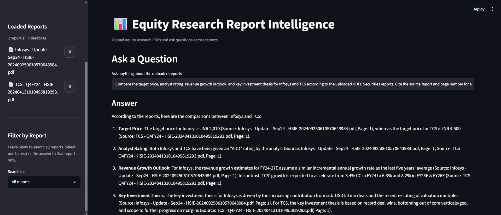
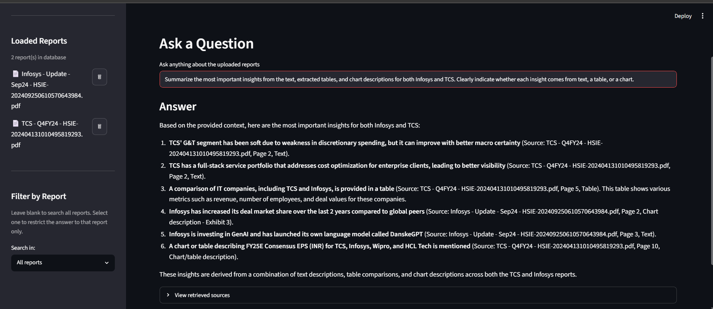
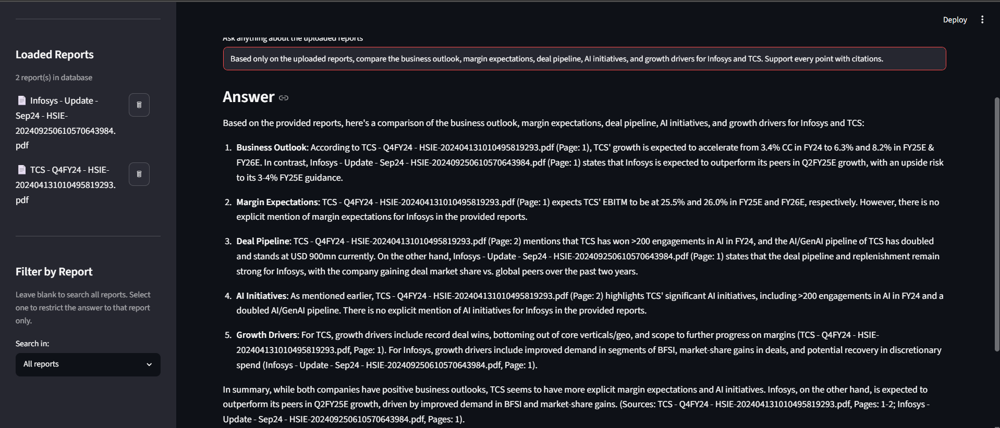

# Equity Research Report Intelligence

### A Multimodal Retrieval-Augmented Generation (RAG) System for Equity Research Reports

## Overview

Equity research reports contain valuable information in multiple formats such as text, financial tables, and charts. Traditional RAG applications usually extract only text, which means important insights from tables and visualizations are often missed.

I built this project to explore how a multimodal RAG pipeline can understand all three content types while supporting questions across multiple equity research reports. The system extracts text, tables, and charts from PDF reports, stores them in a vector database, retrieves the most relevant information, reranks the results using a Cross-Encoder, and generates grounded answers with proper source citations.

---

# Features

- Extracts text from PDF reports and creates semantic chunks.
- Extracts financial tables using pdfplumber.
- Understands charts using Gemini Vision.
- Stores embeddings in ChromaDB for semantic search.
- Supports searching across multiple research reports.
- Prevents duplicate report uploads.
- Allows deleting individual reports from the vector database.
- Supports filtering queries by a specific report.
- Performs cross-document comparison.
- Uses a two-stage retrieval pipeline with Cross-Encoder reranking for better retrieval quality.
- Generates grounded answers with report and page citations.

---

# System Architecture

```text
                  PDF Research Reports
                          │
          ┌───────────────┼───────────────┐
          │               │               │
       Text           Tables          Charts
          │               │               │
          └───────────────┼───────────────┘
                          │
                 Embedding Generation
            (all-MiniLM-L6-v2 Sentence Transformer)
                          │
                     Chroma Vector DB
                          │
               Retrieve Top-50 Candidates
                          │
         Cross-Encoder (MS MARCO MiniLM)
                          │
              Select Top-5 Relevant Chunks
                          │
                Groq Llama 3.3
                          │
         Grounded Answer with Source Citations
```

---

# Tech Stack

- Python
- Streamlit
- ChromaDB
- Sentence Transformers
- Cross-Encoder (MS MARCO MiniLM)
- LangChain Text Splitters
- PyMuPDF
- pdfplumber
- Google Gemini Vision
- Groq API

---

# Project Layers

## Layer 1 – Text RAG

The first layer focuses on extracting text from PDF reports, splitting it into semantic chunks, generating embeddings, and storing them inside ChromaDB for retrieval.

**Key Features**

- PDF text extraction
- Recursive chunking
- Embedding generation
- Vector storage

---

## Layer 2 – Table Intelligence

Financial reports contain important information inside tables. This layer extracts those tables, converts them into markdown, and indexes them so they can be retrieved just like normal text.

**Key Features**

- Table extraction
- Markdown conversion
- Table indexing

---

## Layer 3 – Chart Intelligence

Many important insights are presented as charts rather than text. This layer detects chart regions, crops them, generates descriptions using Gemini Vision, and stores those descriptions as searchable chunks.

**Key Features**

- Exhibit detection
- Chart cropping
- Gemini Vision descriptions
- Image indexing

---

## Layer 4 – Multi-Document Intelligence

This layer enables searching across multiple research reports instead of a single PDF. It also adds report management features such as duplicate prevention, deleting reports, filtering by report, and prompting the LLM to compare information across different documents.

**Key Features**

- Duplicate upload prevention
- Report management
- Delete reports
- Report filtering
- Cross-document prompting

---

## Layer 5 – Retrieval Optimization

Instead of sending the first retrieved chunks directly to the LLM, the system first retrieves a larger candidate set and then reranks those candidates using a Cross-Encoder to improve retrieval quality.

**Key Features**

- Retrieve Top-50 candidate chunks
- Cross-Encoder reranking
- Return Top-5 most relevant chunks

---

# Folder Structure

```text
equity-research-rag/
├── app.py
├── ingestion.py
├── retrieval.py
├── generation.py
├── config.py
├── requirements.txt
└── README.md
```

---
# Example Questions

## 1. Multi-Document Comparison

**Question**

> Compare the target price, analyst rating, revenue growth outlook, and key investment thesis for Infosys and TCS according to the uploaded HDFC Securities reports. Cite the source report and page number for every comparison.



---

## 2. Multimodal Retrieval (Text + Tables + Charts)

**Question**

> Summarize the most important insights from the text, extracted tables, and chart descriptions for both Infosys and TCS. Clearly indicate whether each insight comes from text, a table, or a chart.



---

## 3. Cross-Document Business Analysis

**Question**

> Based only on the uploaded reports, compare the business outlook, margin expectations, deal pipeline, AI initiatives, and growth drivers for Infosys and TCS. Support every point with citations.



---
# License

This project was built for learning, research, and portfolio purposes.
